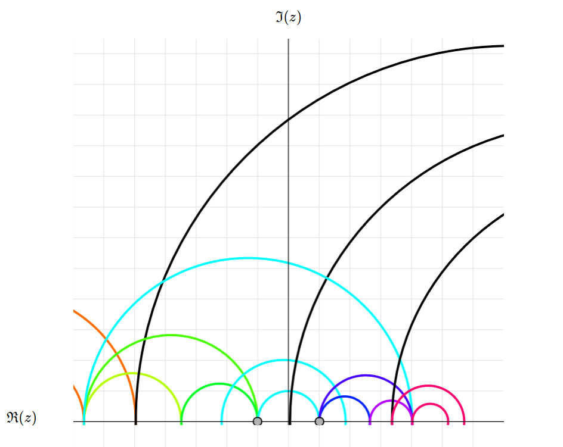

*English below*

## Demi-plan de Poincaré

Ce programme, inspiré de <a href="https://github.com/samueleblanc/riemannsphere" target="_blank">celui-ci</a>, permet de visualiser de manière interactive des transformations sur le demi-plan de Poincaré directement sur internet. 

### Téléchargement et utilisation

* Cliquez sur la version la plus récente (*Latest*) dans la section **Releases** à la droite de l'écran.
* Cliquez sur ``upperhalfplane-vx.zip``.
* Dans votre dossier *Téléchargements*, vous devriez y voir ``upperhalfplane-vx.zip``, que vous pouvez décompresser (extraire).
* Dans le nouveau dossier *upperhalfplane-vx*, double-cliquez sur ``index_fr.html``.

N.B. Si un fichier texte s'ouvre, cliquez sur le bouton droit de la souris et cliquez sur *Ouvrir avec* [votre navigateur web favori]. 

--------------------------------------

## Poincaré half-plane model

This program, inspired by <a href="https://github.com/samueleblanc/riemannsphere" target="_blank">this one</a>, lets you visualise in an interactive way transformations on the upper half-plane directly on the internet. 

### Download and usage

* Click on the latest version in the **Releases** section on the right of the screen.
* Click on ``upperhalfplane-vx.zip``.
* In your *Downloads* directory, you should see ``upperhalfplane-vx.zip``, which you can decompress (extract).
* In the new *upperhalfplane-vx* directory, double-click on ``index.html``.

N.B. If a text file opens, right-click on it and click on *Open with* [your favorite web browser].

## License 

MIT